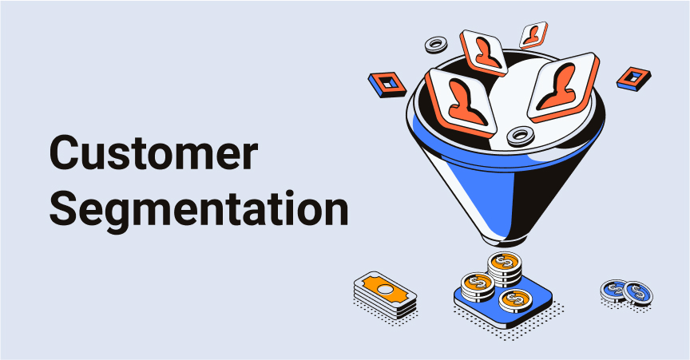
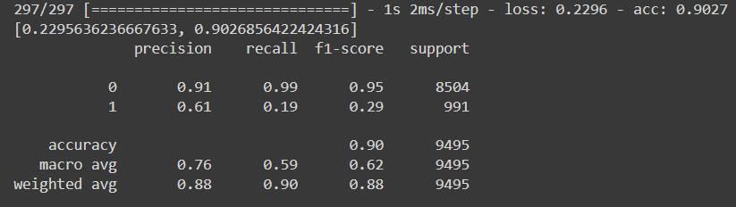

# Customer_Segmentation_DeepLearning :bar_chart:
Customer segmentation is a way to split customers into groups (customer segments) based on certain shared characteristics. All customers share the common need for the product or service; beyond that, they possess distinct demographic differences (i.e., age, gender) and tend to have additional socio-economic, lifestyle, or other behavioral differences that offer companies useful marketing insights that they can use to deepen customer relationships.

## Description :book:
Recently, there has been a decline in revenue for the bank and investigation has been carried out to identify the root of the problem. The bank found out that the reduce in revenue is mainly due to decrement of the deposition of money into the bank by the clients. Hence, the bank decided to conduct marketing campaigns to encourage more clients to deposit money into the bank. Gathering client demands and general satisfaction is the goal of the marketing campaigns. There are a few essential aspects of the marketing campaign namely, customer segmentation, promotional strategy, and etc. Correctly identified strategy may help to expand and grow the bank’s revenue. By the data provided, our aim in this project is to predict accurately whether the customer will subscribe to the focus product for the campaign - Term Deposit after the campaign.

## Aproach :triangular_flag_on_post:

- Gathering the data:
Data preparation is the primary step for any deep learning problem. By using a dataset from Kaggle for this problem. This dataset consists of one CSV files that will be use for training. There is a total of 18 columns in the dataset that consists of two types of data which are categorical data and continuous data. Due to our objectives, this project is classified as a classification problem.

- Data Inspection/ Visualization:
Here is where the data visualization is carried on. The mean, median, standard deviation, outliers, graph and etc are all presented in this section for the better understanding about our dataset. 

.PNG)

However, by using the command `df.info()` we noticed that `'the days_since_prev_campaign_contact'` column have so many NaN value. Hence, the column will be removed in data cleaning section.

- Cleaning the Data: 
The quality of our data determines the quality of our deep learning model. So it is always necessary to clean the data before feeding it to the model for training. Here, the unnecessary column is been removed such as `'id'` and  `'the days_since_prev_campaign_contact'` columns. Then, no duplicated data is been found in this dataset. Since some of our data is in string, the label encoder is been carried to change all the string into numeric. Lastly, KNN Imputer is choosed as a method to impute the NaN value.

- Feature Selection:
Feature Selection is the method of reducing the input variable to the model by using only relevant data and getting rid of noise in data. It is the process of automatically choosing relevant features for the machine learning model based on the type of problem that need to solve. Since the target column in this project is the categorical type, Cramer's V is been used to solve the categorical vs categorical data type while logistic regression is for continuous vs categorical.
However, when the feature selection is been carried, the accuracy of the model is around 90%

By comparing the accuracy achieved of the model with feature selection and no feature selection, we decided that the model will be run with no feature selection since the accuracy have achieved around 92% without reducing the input variable.

- Data Preprocessing:
In this section, the technique of preparing the raw data to make it suitable for a building and training Deep Learning models. 
Here, the scaling, one hot encoder and splitting the data is been done.

- Model development:
Then, we define the model with adding the batch normalization, dropout and dense between the layers. EarlyStopping callback is been used to prevent overfitting.
The architecture of the model is plotted using plot_model function as below.

- Model Analysis/Evaluation:
Model evaluation is the process of analysing a deep learning model's performance, as well as its strengths and limitations, using various evaluation criteria. Model evaluation is critical for determining a model's efficacy during the early stages of research, as well as for model monitoring. Hence, confusion matrix is been presented as a part of the model evaluation while the classification report and accuracy have already been mentioned above.

## Discussion :books:
From this model, around 92% accuracy can be achieved during training and the low F1 score is obtained, which is due to the imbalance dataset. The total count of term_deposite_subscribed which is equal to 0 is way higher than 1, which causes imbalance of data and inaccurate prediction of the model. Thus, adding more data may help to improve the model. 

## Credits :open_file_folder:
This project is made possible by the data provided from kaggle:
[kaggle](https://www.kaggle.com/datasets/kunalgupta2616/hackerearth-customer-segmentation-hackathon)

